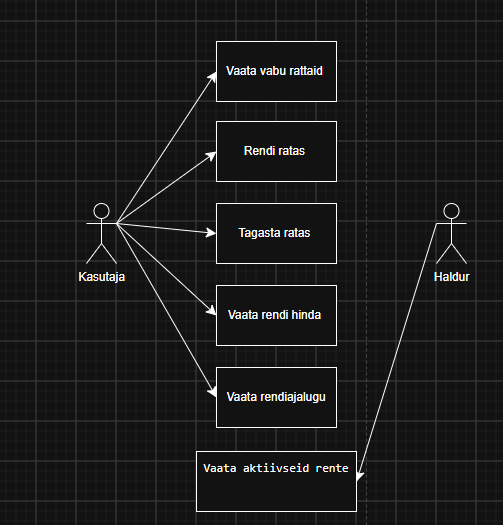
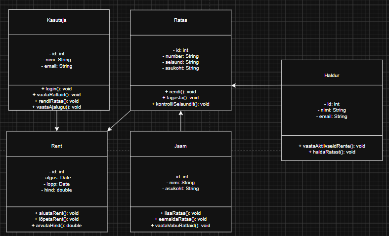
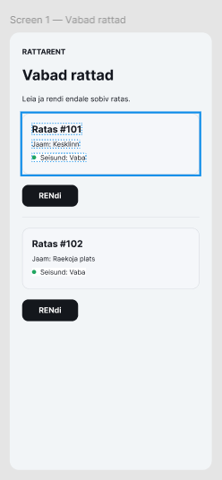
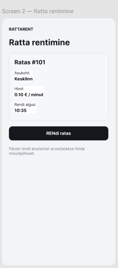

# Rattarent

Rattarent on süsteem, mille abil kasutajad saavad vaadata vabu 
jalgrattaid, rentida ratta, selle tagastada ja vaadata rendiinfot.

**Tegijad:** Eesnimi Perekonnanimi, Eesnimi Perekonnanimi  
**Grupp:** TA-24

## Kasutajad ja nõuded

Süsteemil on kaks rolli: kasutaja ja haldur.

Kasutaja saab vaadata vabu rattaid, rentida ja tagastada ratta 
ning vaadata rendiinfot ja rendiajalugu.

Haldur saab vaadata aktiivseid rente ja hallata rattaid.

Kuus kasutajalugu on GitHub Issues all. Kõige tähtsamad lood 
on märgitud `must`.

## Arendusmudel

Me valisime Rattarendi süsteemi jaoks inkrementaalse arendusmudeli. 
Kõigepealt arendaksime rataste vaatamise ja rentimise funktsioonid, 
sest need on süsteemi kõige tähtsamad osad. 
Seejärel lisaksime ratta tagastamise ja rendi hinna arvutamise. 
Pärast seda saaksime lisada rendiajaloo ja halduri funktsioonid. 
Kosemudel ei sobiks nii hästi, sest süsteemi vajadused võivad 
arendamise ajal muutuda.

## Diagrammid

## Makett

Me tegime maketi iteratiivselt, sest vaatasime mõlemad ekraanid 
üle ja täiendasime neid vastavalt kasutajalugudele.

## Kuidas me töötasime

Kasutasime Miro Kanban-tahvlit, kus töö liikus veergudes 
Teha, Teen ja Valmis.

Meie töö jagunes kahe paari vahel ja kasutasime GitHubis 
harusid ning Pull Requeste.

Kõige raskem oli diagrammide ja kasutajalugude omavaheline 
ühendamine.

## Retrospektiiv

Kasutajalugude kirjutamine ja GitHub Issues kasutamine läks hästi.

Kõige raskem oli klassidiagrammi seoste ja kordsuste määramine.

Järgmisel korral planeeriksime UML-diagrammide tegemiseks rohkem aega.
